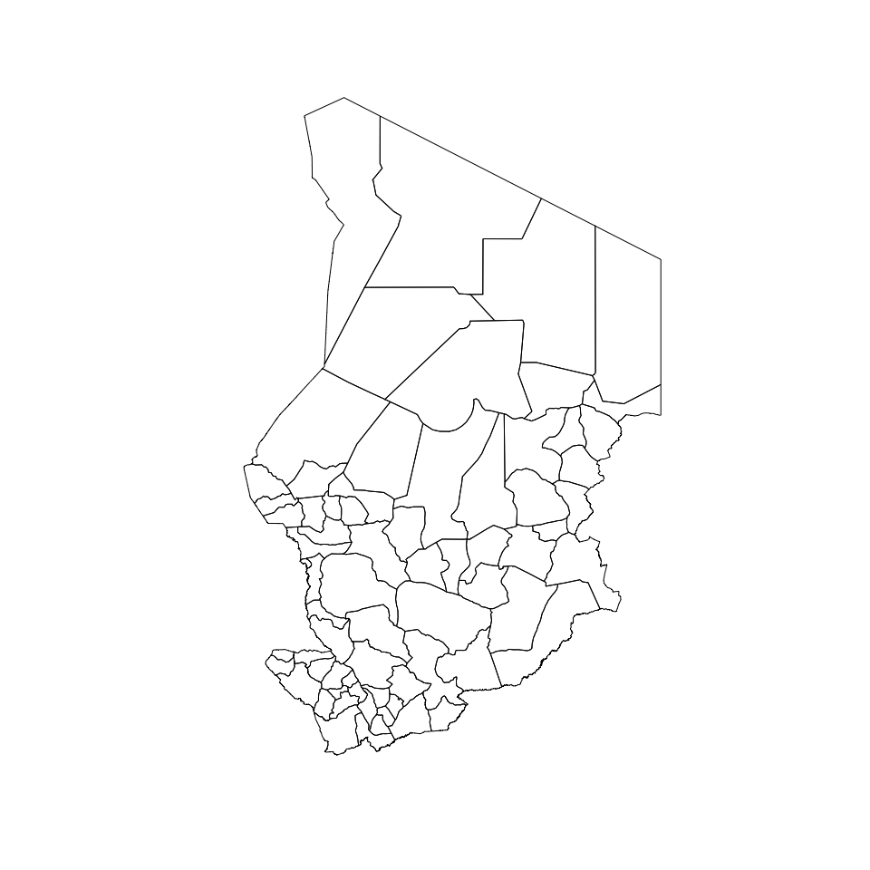
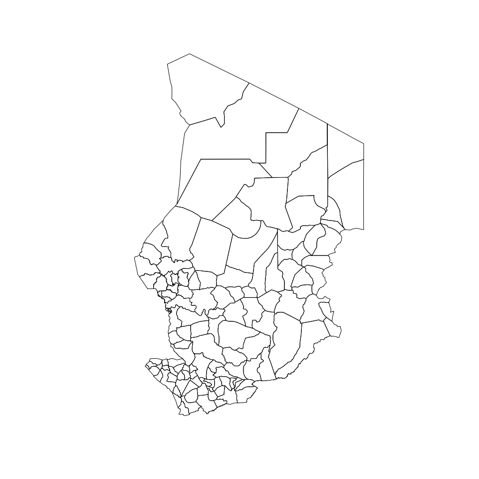
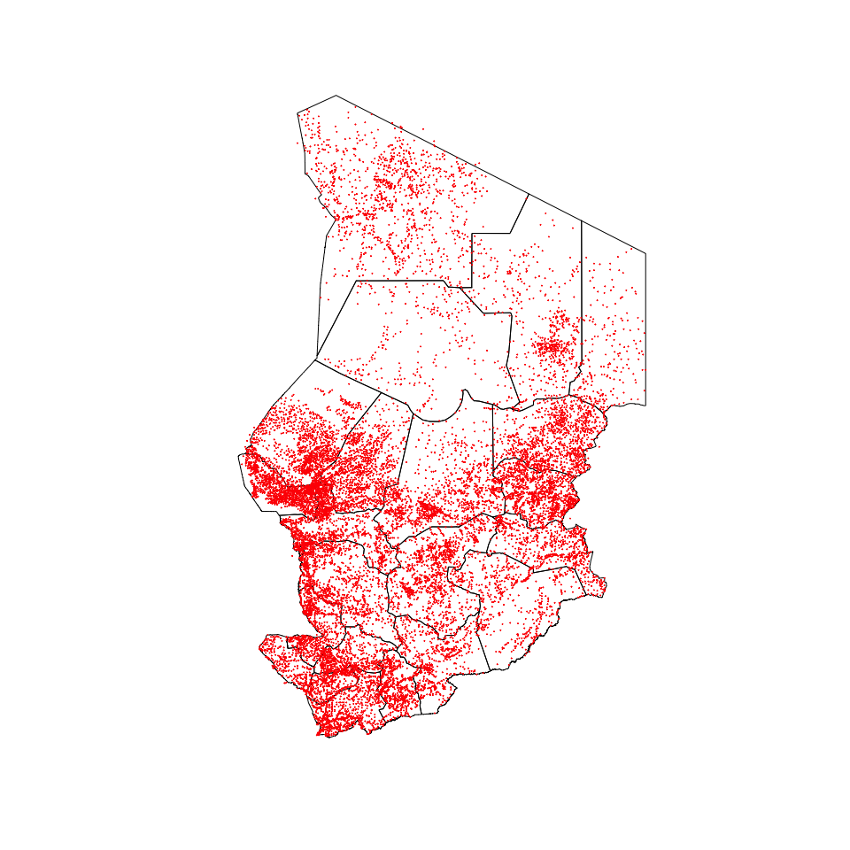

<!-- README.md is generated from README.Rmd. Please edit that file -->

# chad: Datasets for Use in Designing Surveys in Chad 

<!-- badges: start -->

[](https://www.repostatus.org/#active)
[](https://lifecycle.r-lib.org/articles/stages.html#experimental)
[](https://github.com/spatialworks/chad/actions)
[](https://www.codefactor.io/repository/github/spatialworks/chad)
[](https://zenodo.org/badge/latestdoi/417356740)
<!-- badges: end -->

Designing surveys require relevant datasets to be used as basis for
sample size calculations, sampling design, survey planning/logistics and
survey implementation. These include datasets on population, lists of
sampling clusters, map datasets for spatial sampling, and previous
survey datasets that can be used for estimating indicator variance and
design effects. This package contains relevant datasets for use in
designing surveys in Chad.

## Installation

The development version of the `{chad}` package can be installed from
[GitHub](https://github.com/) with:

``` r
if (!require(remotes)) install.packages("remotes")
remotes::install_github("spatialworks/chad")
```

## Usage

### Region borders

The Chad region borders is accessed via the `regions` dataset.

``` r
chad::regions
#> Simple feature collection with 23 features and 13 fields
#> Geometry type: POLYGON
#> Dimension:     XY
#> Bounding box:  xmin: 13.47348 ymin: 7.44107 xmax: 24 ymax: 23.43944
#> Geodetic CRS:  WGS 84
#> First 10 features:
#>           admin1Name admin1Pcod        admin1RefN        admin1Na_1 admin1AltN
#> 1              Batha       TD01             Batha             BATHA       <NA>
#> 2             Borkou       TD02            Borkou            BORKOU       <NA>
#> 3     Chari-Baguirmi       TD03    Chari-Baguirmi    CHARI-BAGUIRMI       <NA>
#> 4              Guéra       TD04             Guera             GUERA       <NA>
#> 5       Hadjer-Lamis       TD05      Hadjer-Lamis      HADJER LAMIS       <NA>
#> 6              Kanem       TD06             Kanem             KANEM       <NA>
#> 7                Lac       TD07               Lac               LAC       <NA>
#> 8  Logone Occidental       TD08 Logone Occidental LOGONE OCCIDENTAL       <NA>
#> 9    Logone Oriental       TD09   Logone Oriental   LOGONE ORIENTAL       <NA>
#> 10           Mandoul       TD10           Mandoul           MANDOUL       <NA>
#>    admin1Al_1 admin0Name admin0Pcod       date    validOn validTo Shape_Leng
#> 1        <NA>      Tchad         TD 2016-03-15 2016-05-09    <NA>  12.859463
#> 2        <NA>      Tchad         TD 2016-03-15 2016-05-09    <NA>  15.334343
#> 3        <NA>      Tchad         TD 2016-03-15 2016-05-09    <NA>  10.282660
#> 4        <NA>      Tchad         TD 2016-03-15 2016-05-09    <NA>  12.081014
#> 5        <NA>      Tchad         TD 2016-03-15 2016-05-09    <NA>   9.789328
#> 6        <NA>      Tchad         TD 2016-03-15 2016-05-09    <NA>  11.907133
#> 7        <NA>      Tchad         TD 2016-03-15 2016-05-09    <NA>   6.471361
#> 8        <NA>      Tchad         TD 2016-03-15 2016-05-09    <NA>   3.928428
#> 9        <NA>      Tchad         TD 2016-03-15 2016-05-09    <NA>   8.194939
#> 10       <NA>      Tchad         TD 2016-03-15 2016-05-09    <NA>   5.997929
#>    Shape_Area                       geometry
#> 1   7.6210426 POLYGON ((19.34077 16.10815...
#> 2  12.7404929 POLYGON ((18.89773 18.66806...
#> 3   3.8809073 POLYGON ((15.404 12.322, 15...
#> 4   5.0574038 POLYGON ((19.77772 13.03076...
#> 5   2.3981196 POLYGON ((15.755 13.163, 15...
#> 6   6.1209700 POLYGON ((17.17024 16.03506...
#> 7   1.8103005 POLYGON ((13.7291 14.51277,...
#> 8   0.7273342 POLYGON ((16.381 9.21, 16.4...
#> 9   1.9443169 POLYGON ((16.57123 9.151308...
#> 10  1.4335490 POLYGON ((17.507 9.616, 17....
```

The regions borders of Chad can be plotted by:

``` r
plot(st_geometry(chad::regions))
```


### Department borders

The Chad department borders is accessed via the `departments` dataset.

``` r
chad::departments
#> Simple feature collection with 70 features and 16 fields
#> Geometry type: POLYGON
#> Dimension:     XY
#> Bounding box:  xmin: 13.47348 ymin: 7.44107 xmax: 24 ymax: 23.43944
#> Geodetic CRS:  WGS 84
#> First 10 features:
#>    OBJECTID   admin2Name admin2Pcod   admin2RefN   admin2Na_1 admin2AltN
#> 1         1  Batha Ouest     TD0101  Batha Ouest  BATHA OUEST       <NA>
#> 2         2    Batha Est     TD0102    Batha Est    BATHA EST       <NA>
#> 3         3        Fitri     TD0103        Fitri        FITRI       <NA>
#> 4         4       Borkou     TD0201       Borkou       BORKOU       <NA>
#> 5         5     Baguirmi     TD0301     Baguirmi     BAGUIRMI       <NA>
#> 6         6        Chari     TD0302        Chari        CHARI       <NA>
#> 7         7   Loug-Chari     TD0303   Loug-Chari   LOUG-CHARI       <NA>
#> 8         8        Guéra     TD0401        Guera        GUERA       <NA>
#> 9         9    Abtouyour     TD0402    Abtouyour    ABTOUYOUR       <NA>
#> 10       10 Barh-Signaka     TD0403 Barh-Signaka BARH-SIGNAKA       <NA>
#>    admin2Al_1     admin1Name admin1Pcod admin0Name admin0Pcod       date
#> 1        <NA>          Batha       TD01      Tchad         TD 2016-04-07
#> 2        <NA>          Batha       TD01      Tchad         TD 2016-04-07
#> 3        <NA>          Batha       TD01      Tchad         TD 2016-04-07
#> 4        <NA>         Borkou       TD02      Tchad         TD 2016-04-07
#> 5        <NA> Chari-Baguirmi       TD03      Tchad         TD 2016-04-07
#> 6        <NA> Chari-Baguirmi       TD03      Tchad         TD 2016-04-07
#> 7        <NA> Chari-Baguirmi       TD03      Tchad         TD 2016-04-07
#> 8        <NA>          Guéra       TD04      Tchad         TD 2016-04-07
#> 9        <NA>          Guéra       TD04      Tchad         TD 2016-04-07
#> 10       <NA>          Guéra       TD04      Tchad         TD 2016-04-07
#>       validOn ValidTo Shape_Leng Shape_Area                       geometry
#> 1  2017-06-15    <NA>  11.667382  4.0913115 POLYGON ((19.34077 16.10815...
#> 2  2017-06-15    <NA>   8.078575  2.5555799 POLYGON ((20.043 15.742, 20...
#> 3  2017-06-15    <NA>   4.222495  0.9741512 POLYGON ((17.533 13.48, 17....
#> 4  2017-06-15    <NA>  11.240590  6.1392969 POLYGON ((20.54311 17.94151...
#> 5  2017-06-15    <NA>   7.131149  2.2501481 POLYGON ((16.45 12.305, 16....
#> 6  2017-06-15    <NA>   3.715286  0.3645872 POLYGON ((15.404 12.322, 15...
#> 7  2017-06-15    <NA>   5.364202  1.2661720 POLYGON ((17.033 11.065, 17...
#> 8  2017-06-15    <NA>   4.110334  0.6972816 POLYGON ((19.10299 12.69395...
#> 9  2017-06-15    <NA>   3.953830  0.7969211 POLYGON ((18.33026 12.61748...
#> 10 2017-06-15    <NA>   7.100539  2.6718339 POLYGON ((17.747 11.652, 17...
```

The department borders of Chad can be plotted by:

``` r
plot(st_geometry(chad::departments))
```



### District borders

The Chad district borders is accessed via the `districts` dataset.

``` r
chad::districts
#> Simple feature collection with 126 features and 4 fields
#> Geometry type: MULTIPOLYGON
#> Dimension:     XY
#> Bounding box:  xmin: 13.46912 ymin: 7.458313 xmax: 24.00888 ymax: 23.49451
#> Geodetic CRS:  WGS 84
#> First 10 features:
#>    NomDistri      RegName       X       Y                       geometry
#> 1    Rig Rig        Kanem 14.2322 14.6264 MULTIPOLYGON (((14.42319 14...
#> 2  Massakory Hadjer Lamis 15.7833 12.9374 MULTIPOLYGON (((16.12717 12...
#> 3      Mondo        Kanem 15.7066 13.5361 MULTIPOLYGON (((15.94408 13...
#> 4     Noukou        Kanem 14.6111 15.2358 MULTIPOLYGON (((15.10878 14...
#> 5     Ntiona        Kanem 15.5935 15.5620 MULTIPOLYGON (((15.33878 14...
#> 6        Mao        Kanem 15.2275 14.1014 MULTIPOLYGON (((16.07344 14...
#> 7       Liwa          Lac 13.9661 14.0599 MULTIPOLYGON (((14.6474 13....
#> 8  Bagassola          Lac 14.1878 13.4744 MULTIPOLYGON (((14.44293 13...
#> 9   Isseirom          Lac 15.0662 13.5395 MULTIPOLYGON (((15.16977 13...
#> 10    Ngouri          Lac 15.3398 13.5091 MULTIPOLYGON (((15.49462 13...
```

The district borders of Chad can be plotted by:

``` r
plot(st_geometry(chad::districts))
```



### Villages/settlements

The Chad villages/settlements data is accessed via the `settlements`
dataset.

``` r
chad::settlements
#> Simple feature collection with 16963 features and 15 fields
#> Geometry type: POINT
#> Dimension:     XY
#> Bounding box:  xmin: 13.56667 ymin: 7.483333 xmax: 24 ymax: 23.15
#> Geodetic CRS:  WGS 84
#> First 10 features:
#>    OBJECTID_1 Field1 OBJECTID_2 OBJECTID                    Nom Latitude
#> 1           1    683        684      684             Al Mouaran 13.56667
#> 2           2  10691      10692    10698                  Hebil 13.66667
#> 3           3  18112      18114    18120             Ouadi Rime 14.03333
#> 4           4   9628       9629     9634          Goz Ben Seref 14.11667
#> 5           5   9679       9680     9685            Goz Tenetip 14.01667
#> 6           6  19166      19168    19174            Rahat Salak 14.23333
#> 7           7   9646       9647     9652               Goz Geti 14.36667
#> 8           8   8962       8963     8968                  Gemel 14.68333
#> 9           9   4208       4209     4214              Bir Selia 14.85000
#> 10         10   5849       5850     5855 Depression de Doumbour 14.86667
#>    Longitude      D      E    F       G                     H Cas Morts
#> 1   18.05000 133400 180300 AA80 ND34-09             ALMOUARAN   0     0
#> 2   18.11667 134000 180700 AA81 ND34-09                 HEBIL   0     0
#> 3   18.05000 140200 180300 AA85 ND34-05            RIME OUADI   0     0
#> 4   18.11667 140700 180700 AA86 ND34-05          BENSEREF GOZ   0     0
#> 5   18.13333 140100 180800 AA95 ND34-05           TENETIP GOZ   0     0
#> 6   18.13333 141400 180800 AA97 ND34-05           SALAK RAHAT   0     0
#> 7   18.16667 142200 181000 AA99 ND34-05              GETI GOZ   0     0
#> 8   18.06667 144100 180400 AB82 ND34-05                 GEMEL   0     0
#> 9   18.13333 145100 180800 AB94 ND34-05             SELIA BIR   0     0
#> 10  18.13333 145200 180800 AB94 ND34-05 DOUMBOUR DEPRESSIONDE   0     0
#>                                                                                                                                                                                                                                                         Alt_names
#> 1  Al Mougran, Al Mougrane, Al Oudei Sakair, Ouadi el Ouadey, Oued el Oudei, Wadi el Oudei, Al Mougrane, Al Oudei Sakair, Ouadi el Ouadey, Oued el Oudei, Wadi el Oudei, Al Oudei Sakair, Ouadi el Ouadey, Oued el Oudei, Wadi el Oudei, Ouadi el Ouadey, Oued el
#> 2                                                                                                                                                                                                                                                            <NA>
#> 3                                                                                                                                                                                                                                                      Wadi Rime,
#> 4                                                                                                                                                                                                                                                            <NA>
#> 5                                                                                                                                                                                                                                                            <NA>
#> 6                                                                                                                                                                                                                                                            <NA>
#> 7                                                                                                                                                                                                                                                         Guetty,
#> 8                                                                                                                                                                                                                                                            <NA>
#> 9                                                                                                                                                                                                                                                            <NA>
#> 10                                                                                                                                                                                                                                                           <NA>
#>                     geometry
#> 1     POINT (18.05 13.56667)
#> 2  POINT (18.11667 13.66667)
#> 3     POINT (18.05 14.03333)
#> 4  POINT (18.11667 14.11667)
#> 5  POINT (18.13333 14.01667)
#> 6  POINT (18.13333 14.23333)
#> 7  POINT (18.16667 14.36667)
#> 8  POINT (18.06667 14.68333)
#> 9     POINT (18.13333 14.85)
#> 10 POINT (18.13333 14.86667)
```

The villages/settlements of Chad can be plotted by:

``` r
plot(st_geometry(chad::regions))
plot(st_geometry(chad::settlements), pch = 21, cex = 0.1, col = "red", add = TRUE)
```


