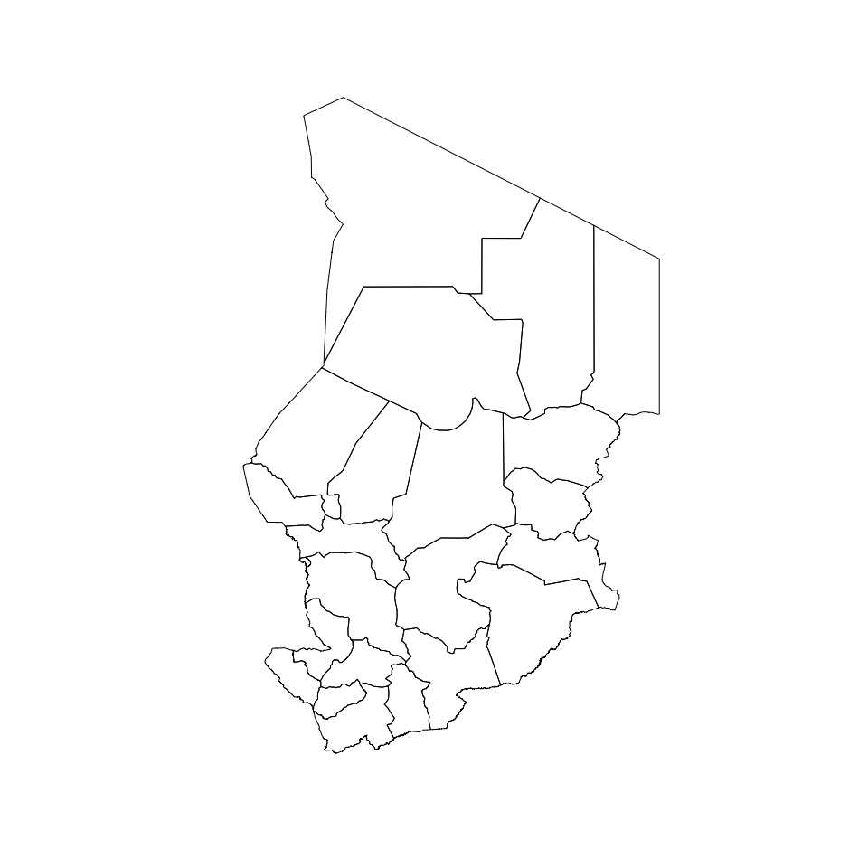

<!-- README.md is generated from README.Rmd. Please edit that file -->

# chad: Datasets for Use in Designing Surveys in Chad

<!-- badges: start -->

[](https://lifecycle.r-lib.org/articles/stages.html#experimental)
[](https://github.com/spatialworks/chad/actions)
[](https://www.codefactor.io/repository/github/spatialworks/chad)
<!-- badges: end -->

The goal of chad is to …

## Installation

The development version of the `{chad}` package can be installed from
[GitHub](https://github.com/) with:

``` r
if (!require(remotes)) install.packages("remotes")
remotes::install_github("spatialworks/chad)
```

## Usage

### Region borders

The Chad region borders is accessed via the `regions` dataset.

``` r
chad::regions
#> Simple feature collection with 23 features and 13 fields
#> Geometry type: POLYGON
#> Dimension:     XY
#> Bounding box:  xmin: 13.47348 ymin: 7.44107 xmax: 24 ymax: 23.43944
#> Geodetic CRS:  WGS 84
#> First 10 features:
#>           admin1Name admin1Pcod        admin1RefN        admin1Na_1 admin1AltN
#> 1              Batha       TD01             Batha             BATHA       <NA>
#> 2             Borkou       TD02            Borkou            BORKOU       <NA>
#> 3     Chari-Baguirmi       TD03    Chari-Baguirmi    CHARI-BAGUIRMI       <NA>
#> 4              Guéra       TD04             Guera             GUERA       <NA>
#> 5       Hadjer-Lamis       TD05      Hadjer-Lamis      HADJER LAMIS       <NA>
#> 6              Kanem       TD06             Kanem             KANEM       <NA>
#> 7                Lac       TD07               Lac               LAC       <NA>
#> 8  Logone Occidental       TD08 Logone Occidental LOGONE OCCIDENTAL       <NA>
#> 9    Logone Oriental       TD09   Logone Oriental   LOGONE ORIENTAL       <NA>
#> 10           Mandoul       TD10           Mandoul           MANDOUL       <NA>
#>    admin1Al_1 admin0Name admin0Pcod       date    validOn validTo Shape_Leng
#> 1        <NA>      Tchad         TD 2016-03-15 2016-05-09    <NA>  12.859463
#> 2        <NA>      Tchad         TD 2016-03-15 2016-05-09    <NA>  15.334343
#> 3        <NA>      Tchad         TD 2016-03-15 2016-05-09    <NA>  10.282660
#> 4        <NA>      Tchad         TD 2016-03-15 2016-05-09    <NA>  12.081014
#> 5        <NA>      Tchad         TD 2016-03-15 2016-05-09    <NA>   9.789328
#> 6        <NA>      Tchad         TD 2016-03-15 2016-05-09    <NA>  11.907133
#> 7        <NA>      Tchad         TD 2016-03-15 2016-05-09    <NA>   6.471361
#> 8        <NA>      Tchad         TD 2016-03-15 2016-05-09    <NA>   3.928428
#> 9        <NA>      Tchad         TD 2016-03-15 2016-05-09    <NA>   8.194939
#> 10       <NA>      Tchad         TD 2016-03-15 2016-05-09    <NA>   5.997929
#>    Shape_Area                       geometry
#> 1   7.6210426 POLYGON ((19.34077 16.10815...
#> 2  12.7404929 POLYGON ((18.89773 18.66806...
#> 3   3.8809073 POLYGON ((15.404 12.322, 15...
#> 4   5.0574038 POLYGON ((19.77772 13.03076...
#> 5   2.3981196 POLYGON ((15.755 13.163, 15...
#> 6   6.1209700 POLYGON ((17.17024 16.03506...
#> 7   1.8103005 POLYGON ((13.7291 14.51277,...
#> 8   0.7273342 POLYGON ((16.381 9.21, 16.4...
#> 9   1.9443169 POLYGON ((16.57123 9.151308...
#> 10  1.4335490 POLYGON ((17.507 9.616, 17....
```

The regions borders of Chad can be plotted by:

``` r
plot(chad::regions, max.plot = 1, col = NA, main = NULL)
```


